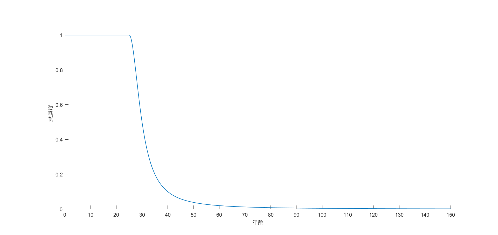
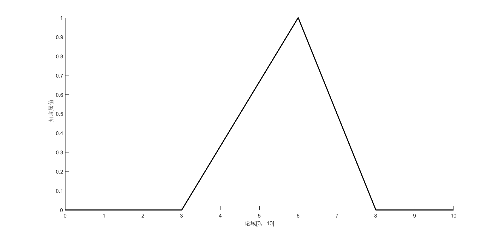
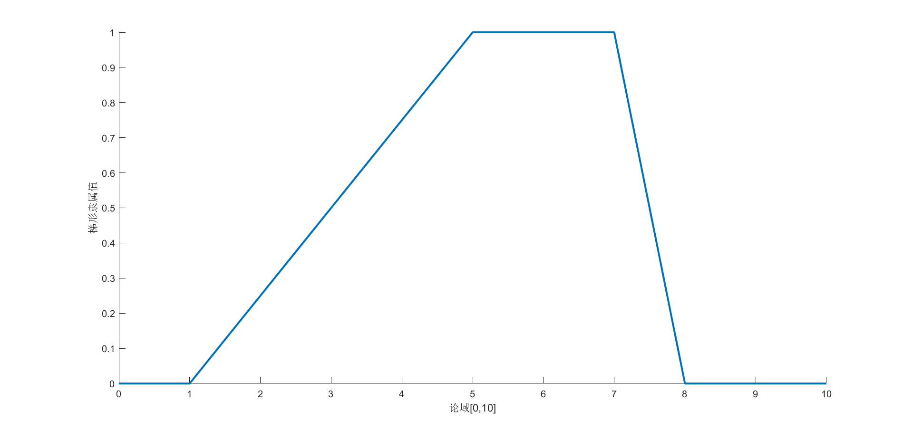

[TOC]

## 模糊理论:smile:

==模糊性==：不确定性，这种不确定性是由于概念外延的不清晰而造成

eg: A在教室的隶属度为0.5，有人拍到A的半个身子在教室的照片

==概率==（基于康托集合）：不确定性，事件是确定的，但是事件的发生是不确定的

eg: A在教室的概率为0.8，基于A在教室和A不在教室两种事件状态

---

​           |(1)在命令行中输入sclp,观察二级倒立摆的运动

Lab-|

​          |

---

### 模糊集的表示方法

==隶属度函数==：定义一定程度属于某个集合的函数

年轻人的隶属度函数(x表示年龄)：
$$
A(x)=\begin{cases} 1,\quad\quad\quad\quad\quad\quad\quad0<=x<=25,\\ [1+(\frac{x-25}{5})^2]^-1,\quad25<x<100,\\0,\quad\quad\quad\quad\quad\quad\quad,x>=100.\end{cases}
$$

(2)Zadeh表示法：当论域为有限集{x~1~,x~2~,........, x~n~}时,X上的一个模糊集合可表示为
$$
A=A(x_1)/x_1+A(x_2)/x_2+....A(x_n)/x_n
$$
此外还可用求和符号表示：
$$

$$
注：式中的‘+’和‘/’并不表示数学运算，只是表示A中的哪些元素及这些元素的隶属度值

多少粒沙子才算一个沙堆

量变:arrow_right:质变           定性（非此即彼）:arrow_right:定量（权值，可信度）

#### 经典隶属函数

(1)==三角形隶属函数==
$$
f(x,a,b,c)=\begin{cases} 0,\quad\quad x<a,\\ \frac{x-a}{b-a},\quad a<=x<=b,\\\frac{c-x}{c-b},\quad b<x<=c,\\0,\quad\quad x>c.\end{cases}
$$

f(x,3,6,8)的图形如下所示：

(2)==梯形隶属函数==
$$
f(x,a,b,c,d)=\begin{cases} 0,\quad\quad x<a,\\ \frac{x-a}{b-a},\quad a<=x<b,\\1,\quad\quad b<=x<c,\\\frac{d-x}{d-c},\quad c<=x<=d,\\0,\quad\quad x>d.\end{cases}
$$
f(x,1,5,7,8)的图形如下所示：

### 语言变量与IF-THEN规则

1.==语言变量==：取自然语言的词语为值，用定义在论域的模糊集来描述

eg:慢速、中速、快速

词语组成：(1)基本术语    (2)逻辑连接词：‘非’、‘且’、‘或’   (3)限定词：非常、差不多

限定词描述：如果A(x)为一模糊集，‘非常A’描述为B(x)=A(x)^2^

eg:小=1/1+0.8/2+0.6/3+0.4/4+0.2/5

非常小=1/1+0.64/2+0.36/3+0.16/4+0.04/5

2.==IF-THEN规则==：IF<模糊命题>THEN<模糊命题>

如果速度慢，则施加给油门较大的力

如果速度快，则施加给油门正常大小的力

如果速度慢，则施加给油门较小的力

#### 模糊蕴涵算子

A(x)->B(y):表示后一个模糊命题的真实程度依赖于前一模糊命题的真实程度

常用模糊蕴涵算子

Mamdani蕴涵算子：x:arrow_right:y=x^y

#### 模糊推理方法

==CRI==：

==三|==：

$$
\mathbf{V}_1 \times \mathbf{V}_2 =  \begin{vmatrix}
\mathbf{i} & \mathbf{j} & \mathbf{k} \\
\frac{\partial X}{\partial u} &  \frac{\partial Y}{\partial u} & 0 \\
\frac{\partial X}{\partial v} &  \frac{\partial Y}{\partial v} & 0 \\
\end{vmatrix}
$$